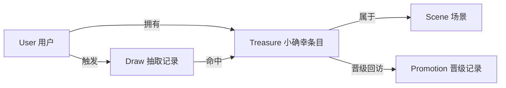
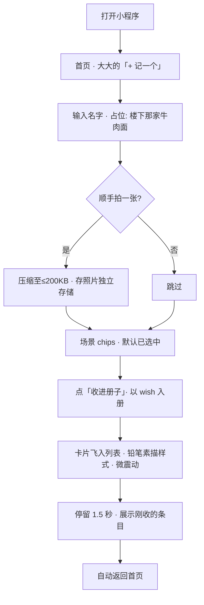
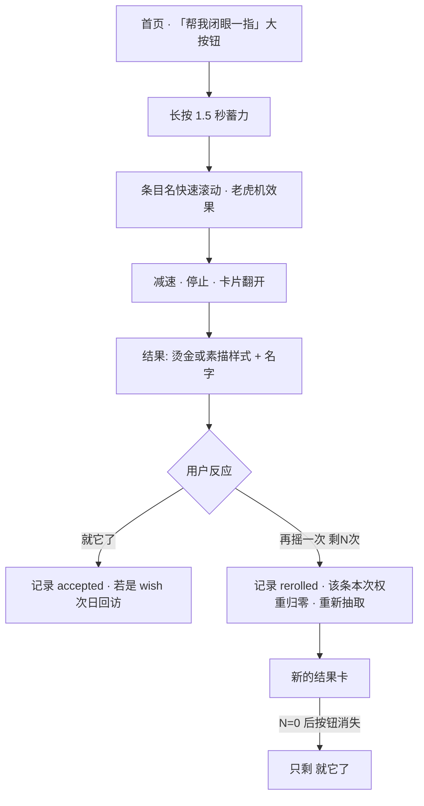
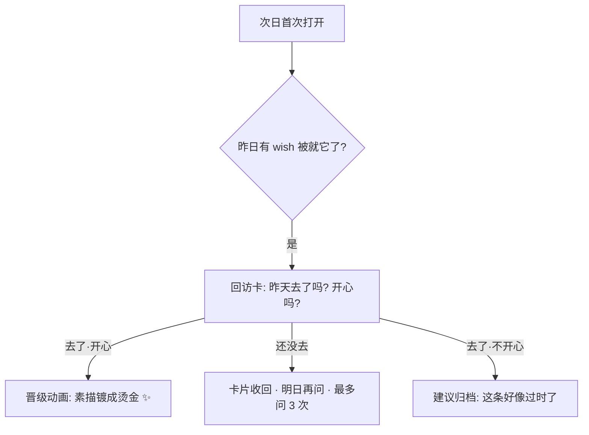
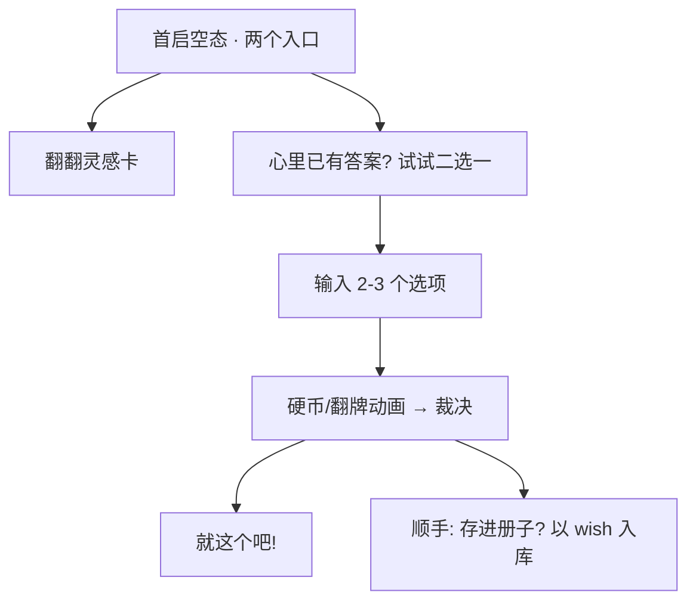
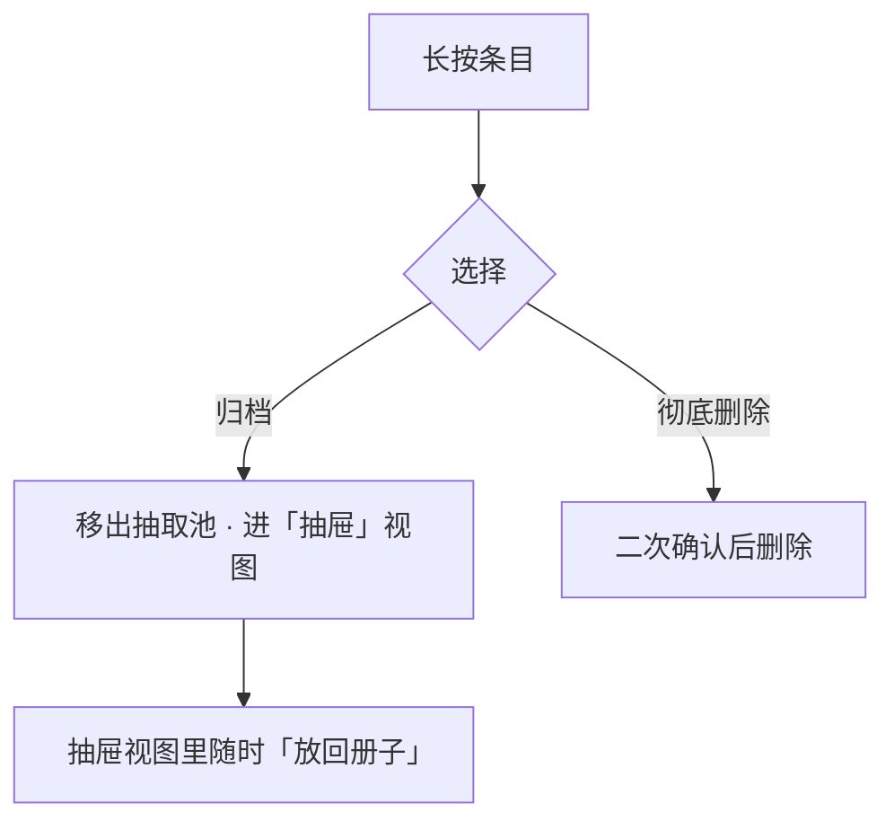

# 「指到你了」产品规格文档

> Working Title: **指到你了**（备选：闭眼一指、小确幸抽签）
> 版本：v0.3 · 2026-09-03
> 平台：微信小程序（数据层架构为平台无关设计，见 §7）
>
> **v0.3 变更**：自定义场景从「固定 1 个」升级为「可增删多个」，并支持在记一个页当场新建（需求 1）；首页新增「今天吃什么」直达（情侣吃什么场景融入，需求 2-A）。
> - ~~自定义场景上限一个~~ → **可增删多个**，label ≤ 4 字 + 同名去重，id 形如 `c:电影`；删除时条目改派回预置场景（§3.2、§5.2）
> - 首页新增 **🍜 今天吃什么** 一键直达：锁定 eat 场景直接开抽（§6.2 备注）
> - 情侣「我们的小确幸」共享池（云同步）未在此版实现，排入 V2（§5.3）
>
> **v0.2 变更**：并入十六条硬约束（见附录 A，正文以【硬约束 #N】引用）。
> 以下 v0.1 立场被正式推翻，理由记录在对应章节：
> - ~~拒绝一切 re-roll~~ → 允许但**硬上限 2 次**（§4.5）
> - ~~均匀随机~~ → **加权随机**（joy × 冷却 × 新鲜度）（§4.2）
> - ~~条目只有单一「已验证」状态~~ → **wish / verified 双状态 + 回访晋级闭环**（§3.2）
> - ~~拒绝模板导入~~ → 拒绝自动灌入，**保留点一下才采纳的手写灵感卡**（§5.1）
> - ~~云开发为真相来源~~ → **本地优先**，同步是可插拔层（§7.2）

---

## 0. 怎么读这份文档

这不是一份功能清单。每个设计决策后面都跟着**为什么**，包括那些被主动否掉的方案——被否掉的方案往往比留下的更能说明产品是什么。如果你只能记住三行：

1. 我们卖的不是「随机选择器」，是「收集快乐」这个动作本身。
2. 一切引入比较、优化、社交表演的功能，无论多「显而易见」，都是毒药。
3. **信任是这个产品的全部资产**【硬约束 #4-#7】：随机的诚实、放宽的诚实、对「今天不想」的尊重，一处撒谎，全部清零。

---

## 1. 产品定义

### 1.1 一句话

**用户收集自己的小确幸——已验证的安全牌和还没去过的心愿——选不出来的时候，程序帮他闭眼一指。**

### 1.2 它解决什么问题 vs 它真正卖什么

- **表层问题**：决策瘫痪。午饭吃什么、周末去哪——选项越多越痛苦。
- **真正的产品**：**收集快乐的行为本身**。想起牛肉面就流口水，把它写下来，这份快乐就被强化了一次。而看着铅笔素描的「心愿」一张张变成烫金的「安全牌」（见 §8 视觉基调），就是「收集」这件事的长期回报【硬约束 #10】。

这个区分决定了所有后续设计：如果产品核心是「随机选择器」，优化方向是更聪明的算法；如果核心是「收集快乐」，优化方向是**让记录更轻、让翻看更甜、让晋级更有仪式感**。我们选后者。

### 1.3 核心闭环

```
收集(想起就记) → 抽取(选不出来时) → 兑现(真的去吃/去玩) → 回访(去过之后,开心吗?) → 晋级(素描变烫金) → 反哺(晋级成就感驱动下一条收集)
```

注意：闭环里多了一环「回访晋级」。**这个晋级闭环就是留存引擎，不是推送通知**【硬约束 #4】。用户回来不是为了清除红点，是为了看「昨晚抽中的那家店，去过之后能不能烫金」。

### 1.4 目标用户

- 有轻微决策困难、且已经发展出「闭眼一指」这类自我应对机制的都市人。
- 对生活有记录欲但被 Notion / 备忘录劝退的人（嫌重、嫌像任务）。
- **不是**：需要「大众决策」场景的用户（聚餐投票、多人协作选店）。

### 1.5 Non-goals（它不是什么）

| 它不是 | 为什么明确写出来 |
|---|---|
| 不是大众点评 | 条目没有店铺信息、没有他人评价。价值恰恰在于**主观且不可迁移** |
| 不是待办/清单工具 | 没有截止时间。快乐不能被「清空」，只能被「收藏」和「归档」 |
| 不是打卡/习惯应用 | streak 会把快乐变成 KPI |
| 不是社交产品 | 收集行为一旦有观众就会表演化（详见拒绝清单） |
| 不是效率工具 | 视觉与交互的每个毛孔都要拒绝「高效」「生产力」的气质【硬约束 #10】 |

---

## 2. 设计原则

每条原则都是后续无数「要不要做这个功能」争论的终审法官。

### P1 · 信任分级（Trust Tiers）

**条目分为 wish（心愿，铅笔素描）和 verified（安全牌，烫金）两个状态，且只能通过「做过之后回访确认开心」晋级。**【硬约束 #4】

为什么：v0.1 的「亲自验证」原则把验证当成入库门槛，这会杀死收集冲动——用户想吃牛肉面但还没吃时，是不允许记下来的。v0.2 的答案是把验证从**入库门槛**改为**终身状态**：什么都能记（wish），但只有被生活盖过章的才能晋升安全牌。「安全牌」模式因此成为对用户的硬承诺：哪怕池子只剩两个，也不偷偷塞进没验证过的项目【硬约束 #6】。

### P2 · 十秒记录（10-Second Capture）

**从「我想记一下」到「记完了」，全程不超过 10 秒、不超过 1 个必填字段。**

为什么：收集是高频、低动机的行为，发生在快乐涌现的那一刻（刚吃完那碗牛肉面，嘴里还有味道），此刻用户只有 10 秒的注意力预算。新条目默认 wish 状态——**不需要用户选状态**，零配置（见 P5）。

### P3 · 重摇有价，上限即承诺（Bounded Re-roll）

**抽取结果默认被执行；「再摇一次」存在，但每次会话硬上限 2 次，用完后该按钮消失，只剩「就它了」。**【硬约束 #1】

为什么：「闭眼一指」有效的关键是把选择权交出去的那一刻就结束了。无限「再摇一次」会把选择困难原样搬回来——用户只是从「在选项间纠结」变成「在抽签结果间纠结」。上限 2 次是刻意校准的妥协：给人的小任性留出口，但出口有门禁。已被跳过的条目在本次会话内权重归零，不会「摇来摇去还是它」。

### P4 · 收集是主角，抽取是彩蛋

**首页视觉重心、运营重心、指标重心都在「收集」，抽取只是收集积累后的自然福利。**

为什么：如果产品被记住的是「转盘抽签工具」，它就和万千 decision wheel 没有区别，用完即走。让人留下的是自己的收藏册——像集邮册，越厚越舍不得走。素描变烫金的晋级可视化（§8）是这条原则的具象化。

### P5 · 默认路径零配置（Zero-Config Default Path）

**主流程上一个配置项都没有。所有筛选关进抽屉，不许挡在主流程前面。**【硬约束 #2】

为什么：配置本身就是一种决策，而决策正是用户想逃开的东西。用户打开这个小程序是为了**少做决定**，任何要求他先选模式、先选场景、先选范围的设计，都是在向用户收「决策税」。用户主动打开抽屉做筛选是被允许的（甚至记住偏好），但记忆的筛选条件必须在界面上可见——隐形的残留条件会让「0 个候选」看起来像程序坏了【硬约束 #16】。

### P6 · 空库是头号杀手（Empty Library Kills）

**产品的第一次「就这个吧」不能依赖任何存量数据。**【硬约束 #11、#12】

为什么：新用户没东西可抽 = 没有第一次「就这个吧」= 没有第一次信任建立。两条防线：手写灵感卡起始包（点一下才采纳，绝不自动灌入）和零数据可用的「二选一」模式。这条原则优先级高于 P1——灵感卡允许以 wish 状态入库（带来源标记），因为空库的死亡比池子纯度的稀释来得更快、更彻底。

---

## 3. 领域模型

### 3.1 实体总览



### 3.2 实体与字段

#### Treasure（小确幸条目）—— 核心实体

| 字段 | 类型 | 必填 | 为什么 |
|---|---|---|---|
| `name` | string ≤ 20 字 | ✅ | 唯一必填项。「楼下那家牛肉面」。P2 的落地 |
| `sceneId` | enum | ✅ | 场景归属（见下），有默认值，用户可以完全不碰 |
| `tier` | enum: `wish` / `verified` | — | 信任分级。**新条目一律 wish，晋级只能走回访确认**【硬约束 #4】。单向：wish → verified；糟糕的 verified 走归档而不是降级（降级是对过去快乐的否定，归档是「现在不适合了」） |
| `joy` | int 1-5 | — | 开心程度。是**加权抽签的输入**【硬约束 #3】，也是高频编辑字段（「这次去感觉值 4 星」）——因此它的更新绝不能触发照片数据重写（见 §7.3 存储分离【硬约束 #15】） |
| `photoRef` | string / null | ❌ | 照片引用 id。**只存引用，不内嵌数据**（§7.3）。V1 无照片时用场景默认素描插图 |
| `note` | string ≤ 50 字 | ❌（V1.5） | 「加辣，不要香菜」。V1 不做，防止记录变成写作 |
| `notToday` | date / null | — | 「今天不想」。当日有效，次日自动失效。它是**被尊重的一等公民**：抽签时默认排除，只有候选一个都凑不出来且类别/预算都已放宽后，才最后放宽它【硬约束 #7】 |
| `status` | enum: `active` / `archived` | — | **归档必须可撤销，且必须有已归档视图**【硬约束 #8】。误点一下就永久消失是不可接受的 |
| `source` | enum: `self` / `starter` | — | 来源标记。灵感卡采纳的条目记 `starter`，让用户知道「这条不是我验证的」 |
| `createdAt` / `updatedAt` | timestamp | — | `updatedAt` 是导入合并语义的裁决依据【硬约束 #9】 |
| `archivedAt` | timestamp / null | — | 归档时间。归档 ≠ 消失，是「收进抽屉」（见 §6.5） |

**刻意不存在的字段**：

- ❌ 优先级 / 权重滑杆：权重由行为数据（joy、冷却、新鲜度）计算，是系统内部逻辑，**不暴露用户可调参数**——「调参」是把快乐工程化，见 §4.2
- ❌ 被抽中次数（对用户可见）：可见统计催生「怎么老抽不到兵马俑」的公平焦虑
- ❌ 公开性 / 分享范围：V1/V1.5 无任何社交读取路径

#### Scene（场景）

预置四个：`🍜 吃什么` `🎉 玩什么` `✈️ 去远方` `💆 休息一下`；**自定义场景可增删多个**（记一个页当场新建，label ≤ 4 字 + 同名去重，id 形如 `c:电影`）。

- 为什么要有场景：**决策是有语境的**。中午十二点的决策池里出现「去拉萨」，抽取立刻失效。场景是抽签质量的地基。
- 为什么允许自定义但用字段约束：自定义是「分类整理欲」的入口，而整理是收集的反面。用 **label ≤ 4 字 + 同名去重** 挡住分类整理欲——长度和去重才是窄门，数量上限挡不住「我就是要分得更细」。删除自定义场景时，其条目改派回预置场景，绝不产生孤儿。
- 场景筛选在抽屉里，默认「全部」——P5。

#### Draw（抽取记录）

| 字段 | 类型 | 为什么 |
|---|---|---|
| `treasureId` | string | 命中的条目 |
| `mode` | enum: `pool` / `safe` | 全池 / 安全牌模式 |
| `sceneFilter` | enum / all | 本次抽取的场景范围 |
| `outcome` | enum: `accepted` / `rerolled` | 「就它了」/ 被重摇跳过。rerolled 累积是退役建议的数据源 |
| `relaxed` | string[] | 本次实际放宽了哪些条件（且放宽真的换来了候选才记录）【硬约束 #5】 |
| `drawnAt` | timestamp | 冷却期计算的输入 |

#### Promotion（晋级记录）—— 留存引擎的数据层

| 字段 | 类型 | 为什么 |
|---|---|---|
| `treasureId` | string | 晋级的条目 |
| `confirmedAt` | timestamp | 用户回访确认开心的时刻 = 素描变烫金的时刻 |
| `drawId` | string | 由哪次抽取兑现而来 |

---

## 4. 抽签引擎（本产品的灵魂模块）

这个模块的规格单独成章，因为它承载了最多的硬约束（#1 #3 #5 #6 #7 #13）。

### 4.1 纯函数契约【硬约束 #13】

```
draw(pool: Treasure[], ctx: DrawContext, rng: RNG): DrawResult
```

- **纯函数**：无副作用、不读时钟（时间作为 `ctx.now` 注入）、不读存储（池子作为参数注入）。
- **可注入 rng**：生产环境用加密随机；测试注入种子 rng，断言可复现。
- 必须有单元测试覆盖：权重计算、冷却归零、放宽阶梯的每一级、放宽无新增时不标记、安全牌模式零污染、重摇后已跳过条目权重归零。**这是产品的灵魂，不能靠手点验证。**

### 4.2 加权随机【硬约束 #3】

```
weight(t) = joy(t)^α × cooldown(t) × freshness(t)     // α 初始 = 1，只调参不上 UI
```

- **cooldown(t)**：距上次抽中的天数。冷却窗口内权重为 **0**（等效排除，解决「又是它？」的 bug 感）；窗口外线性恢复至 1。窗口默认 3 次抽取 / 7 天取小者。
- **freshness(t)**：从未被抽中过的条目 1.5×，否则 1×。新鲜度是「探索」的微弱倾向。
- **为什么 v0.1 的「均匀随机」被推翻**：均匀随机在 30 个条目里会立刻出现短期重复，用户会当成 bug（「又是它？」），对随机性的信任受损——而信任是全部资产。
- **同时保住的底线**：权重输入全部是**行为性和时间性**的（你多久没抽它、你给过它几颗星、它新不新），没有一个是用户声明的「优先级」。没有权重调参面板，用户界面上不存在任何「让某条更容易被抽中」的开关——那是把快乐变成工程问题。

### 4.3 放宽阶梯（Relaxation Ladder）【硬约束 #5 #7】

候选不足（< 最小池，默认 3）时逐级放宽：

```
第 1 级：放宽场景筛选（回到全部场景）
第 2 级：放宽记住的偏好（V1.5：预算区间等）
第 3 级：放宽「今天不想」 —— 永远最后，且仅在连它都用上才能凑出候选时
```

**诚实规则（这条规则的名字就叫诚实）**：

- 每级放宽后重新计算候选数。**只有当放宽真的换来了新候选，才在结果上告知用户**。谎报「我把刚抽过的也算上了」会直接损害用户对随机性的信任【硬约束 #5】。
- 命中了被放宽条件挡住的条目时，结果卡明确标注：「⭐ 抽到的是你说今天不想的那家——它真的很想见你」。用户可以拒绝（计入 rerolled）。

### 4.4 安全牌模式【硬约束 #6】

- 模式开关在抽屉里。开启后池子先过滤 `tier === verified`。
- **硬承诺**：候选哪怕只剩 2 个，也不放宽到 wish。
- 池子为 0 时，呈现诚实的空态：「册子里烫金的只有这些。先去收集，或者翻翻素描们？」——引导到收集或全池模式，**绝不静默污染**。

为什么默认模式不是安全牌：新用户的库全部是 wish（灵感卡以 wish 入库），默认安全牌 = 首次体验必空 = P6 头号杀手。默认全池（wish + verified），结果卡上用视觉语言区分烫金/素描（§8）。

### 4.5 重摇上限【硬约束 #1】

- 结果页主按钮「就它了」，次按钮「再摇一次（剩 N 次）」，N 从 2 递减。
- 用尽后**按钮消失**，只剩「就它了」。用完后只剩一个按钮——这是产品立场：出口有门禁。
- 每次重摇：被跳过条目本次会话权重归零；`outcome = rerolled` 记录。连续 3 次 rerolled 的条目触发归档建议卡片（「牛肉面最近 3 次都没去…让它先进抽屉吗？」）。

### 4.6 二选一模式（零数据裁判）【硬约束 #12】

用户心里已有两三个选项，只想要个裁判：手输 2-3 个选项 → 翻牌动画 → 裁决。

- **不依赖任何存量数据**，是全新用户的最佳第一体验（P6 的第二防线）。
- 裁决后提供「存进册子」（以 wish 入库）——这是从二选一用户转化成收集者的天然通道。

---

## 5. 功能分期

### 5.1 V1 · MVP ——「能收集、能闭眼一指、第一次就灵」

| # | 功能 | 说明 | 为什么 |
|---|---|---|---|
| 1 | 微信静默登录 | 进入即用 | 注册漏斗趋近于零 |
| 2 | 记录小确幸 | 一个输入框 + 场景 chips（默认选中）+ 可选拍照 → 以 **wish** 入库 | P2。不需要选状态——零配置 |
| 3 | 灵感卡起始包 | 首启空态展示手写灵感卡（约 30 张，四场景分布），**点一下才采纳，绝不自动灌入**【硬约束 #11】。采纳的条目以 wish + `source: starter` 入库 | P6 第一防线。卡片文案必须手写、带一句「为什么它大概率会让你开心」——**起始包质量直接决定新手转化** |
| 4 | 二选一模式 | 见 §4.6 | P6 第二防线，零数据可用 |
| 5 | 加权抽签引擎 | 见 §4，含重摇上限、放宽阶梯、诚实规则 | 灵魂模块，含单元测试 |
| 6 | 安全牌模式 | 见 §4.4 | 信任承诺 |
| 7 | 回访晋级闭环 | 抽中并「就它了」的 wish，次日首启弹出回访卡：「昨天去了吗？开心吗？」→ 确认 → **素描变烫金的晋级动画**【硬约束 #4】 | 留存引擎本体 |
| 8 | 列表页 | 按场景分组；烫金/素描双视觉（§8） | 「翻集邮册」的爽感 |
| 9 | 归档（可撤销） | 长按 → 归档（移出抽取池，进「抽屉」视图，可随时恢复）+ 彻底删除（二次确认）【硬约束 #8】 | 归档是「收进抽屉」不是「撕掉」 |
| 10 | 抽屉 | 场景筛选、模式开关、「今天不想」管理。全部默认关闭 | P5：配置关进抽屉 |

**V1 明确不做**：note 字段、预算偏好、导出/导入（已提前落地）、深色模式（纸感暖色本身就是基调）。MVP 的敌人不是缺功能，是每个功能 3 倍的维护成本。

### 5.2 V1.5 ——「备份、偏好、微小的个性」

| # | 功能 | 为什么 |
|---|---|---|
| 1 | 导出/导入 JSON | 导出**不带照片 Blob，只带 photoRef id**【硬约束 #15】。导入是**合并语义**：同 id 条目按 `updatedAt` 取新，**恢复备份不该反而弄丢现有的东西**【硬约束 #9】。能导出就必须能导入——只有单向导出的产品是在绑架用户的数据 |
| 2 | 记住的偏好（预算区间等） | 抽屉内的可持久化筛选。**凡记住的条件，主路径上必须以可见 chips 呈现**【硬约束 #16】 |
| 3 | note 备注字段 | 条目积累了情感，用户自发想补充细节的时机到了 |
| 4 | 自定义场景（可增删多个） | 给「遛娃」「电影」开口子，label ≤ 4 字 + 同名去重，记一个页当场新建 |
| 5 | 抽取仪式个性化 | 长按时长、结果卡样式（2-3 套皮肤） | 仪式感可磨损，提供最小更新空间 |

### 5.3 V2 ——「回忆的时间价值」

| # | 功能 | 为什么 |
|---|---|---|
| 1 | 回忆时间线 | 「一年前的今天，牛肉面第一次烫金」。`Draw` + `Promotion` 数据此刻成熟 |
| 2 | 年度快乐报告 | 一年一次的静态长图。**不做月报/周报**——低频才配得上「年报」的仪式感 |
| 3 | 语音速记 | P2 在语音场景的极限压缩 |
| 4 | 云同步（可插拔层） | 见 §7.2。登录后跨设备，**架构上它本来就是随时可拔掉的** |

### 5.4 主动拒绝清单（Rejected Features）

这张表是本文档最重要的部分。**元原则**：未来任何新功能，如果能在这张表里找到近亲，默认拒绝，除非有人能论证世界发生了变化。每次需求评审显式重读一遍。

| 被拒绝的功能 | 为什么拒绝 |
|---|---|
| **无限 re-roll** | P3。上限 2 次是门禁，无限重摇让随机退化成筛选，决策焦虑从后门回来。注意被拒绝的是「无限」，不是重摇本身 |
| **用户可调的权重/优先级面板** | 权重输入全是行为性数据（joy、冷却、新鲜度），不暴露声明的优先级。「调参」是把快乐工程化 |
| **推荐系统 / 热门榜单** | 往信任池里注水，抽中一个雷就摧毁全部信任 |
| **自动灌入的模板清单** | 与灵感卡的区别就在「点一下才采纳」：同意的成本必须由用户亲手支付，否则违背 P1 的精神。自动灌入还会让空态教育失效 |
| **社交动态/关注/点赞** | 收集行为一旦有观众就会表演化。牛肉面没有 Instagram 价值，但它是这个产品里最典型的条目 |
| **好友协作清单 / 多人投票** | 那是另一个产品（大众决策工具） |
| **统计分析仪表盘**（快乐指数曲线/热力图） | 幸福被量化后就会追逐指标，方向完全反了 |
| **打卡 streak / Push 提醒** | streak 断裂的挫败感摧毁低动机收集；负罪感营销。留存靠晋级闭环，不靠通知【硬约束 #4】 |
| **富文本/长文编辑器** | 记录从 10 秒膨胀成 10 分钟，P2 死亡。note 上限 50 字是刻意的 |
| **自由标签系统** | 标签是整理欲的入口，整理欲是收集欲的反面 |
| **归档即永久删除（无撤销）** | 【硬约束 #8】误点一下就永久消失不可接受。已归档视图是信任的一部分 |
| **覆盖式导入** | 【硬约束 #9】恢复备份弄丢现有数据，是对「备份」这个词的背叛 |

---

## 6. 用户流

### 6.1 收集流（P2 的现场检验）



添加完成后 1.5 秒的停留不是 toast，是「快乐被强化一次」的具象化。

### 6.2 抽签流（含重摇与放宽）



- 放宽发生且真的换来候选时，结果卡顶部一行小字：「已放宽：加入了其他场景的条目」【硬约束 #5】。
- 命中被「今天不想」挡住的条目：明确标注，用户可拒绝。

### 6.3 回访晋级流（留存引擎）



为什么回访卡最多问 3 次：不催。催促是负罪感营销的近亲，晋级闭环的燃料是期待，不是义务。

### 6.4 二选一流（零数据首体验）



### 6.5 归档流（可撤销）



归档的隐喻是「从墙上摘下明信片收进抽屉」——抽屉能再打开，这是和「撕掉」的本质区别【硬约束 #8】。

---

## 7. 技术选型与架构

### 7.1 总览

| 层 | 选择 | 一句话理由 |
|---|---|---|
| 前端 | 微信小程序原生 + TypeScript | 单平台；抽取仪式需要原生手势/动画全控制力 |
| 数据层 | **本地优先**：本地存储为唯一真相来源【硬约束 #14】 | 删掉同步层，App 依然能跑 |
| 同步层 | 可插拔的微信云开发 TCB 适配器 | 登录态免费、零运维、可整体删除 |
| 测试 | Vitest（抽签引擎纯函数单测）【硬约束 #13】 | 产品灵魂不能靠手点验证 |

### 7.2 本地优先架构【硬约束 #14】

**架构铁律，原样生效**：本地存储是真相来源（source of truth），登录/同步是后加的可插拔层。**数据层模块不许知道同步层的存在——整个删掉同步层，App 依然能跑。**

模块边界（依赖只能向下，`core` 零依赖）：

```
core/    领域模型 + 抽签引擎（纯函数，无 IO）
data/    LocalStore 接口 + 实现（真相来源）
photos/  照片独立存储（与主表分离）
sync/    可插拔同步适配器（TCB）——可被物理删除
ui/      小程序页面与组件（只依赖 core + data）
```

**平台翻译说明**（重要）：硬约束 #14/#15 的原始表述是浏览器环境的落地形态——IndexedDB / Dexie。微信小程序没有 IndexedDB，架构原则**原样生效**，实现映射为：`LocalStore` 接口的小程序 storage 适配器 + 照片走独立压缩缓存（LRU 淘汰）。若产品未来以 H5/PWA 形态交付，直接替换为 Dexie 实现，`core/` 与 `ui/` 一行不改。这是把「本地优先」写成接口抽象而非平台绑定的原因。

### 7.3 照片存储分离【硬约束 #15】

- 照片入库前压缩至 ≤ 200KB。
- **存独立存储，不和主表混绑**：主表只存 `photoRef`（id）。原因：更新整行会重写数据，每次改星级/归档都拖着重写一遍照片，列表页会肉眼可见地卡。
- 导出 JSON 不含照片数据，只含 `photoRef`；同步层负责把照片本体搬上云存储。

### 7.4 其他选型决策与被否方案

- **否掉 Taro / uni-app**：单平台，跨端抽象层收益为零、成本为正（动画调试多一层黑盒）。YAGNI 是保护核心体验的实现路径。
- **否掉「云为真相源」**（v0.1 立场）：收集类产品的数据是用户攒了几年的快乐，断网/换机/云故障都不能成为「打不开册子」的理由。云降级为可插拔的同步与备份通道。
- **否掉自建后端**：为 CRUD 密集型小产品引入运维，是用工程师的乐趣换产品的死亡风险。
- **TypeScript**：领域模型（§3）是产品的宪法，用类型系统写下来。

### 7.5 数据库 Schema（本地真相源）

```
users:      { id, createdAt }
treasures:  { id, name, sceneId, tier, joy, photoRef?, note?, notToday?, status, source, createdAt, updatedAt, archivedAt? }
draws:      { id, treasureId, mode, sceneFilter, outcome, relaxed[], drawnAt }
promotions: { id, treasureId, drawId, confirmedAt }
photos:     { id, blob }   // 独立存储，绝不与 treasures 混绑
```

---

## 8. 视觉基调【硬约束 #10】

**纸感暖色、私密收藏册。不是效率工具。**

| 元素 | 设计语言 | 为什么 |
|---|---|---|
| 底色 | 米白/牛皮纸暖色，轻微纸纹 | 「翻册子」的材质记忆，反效率工具气质 |
| verified（安全牌） | **烫金**：金箔质感的边框/角标，微微反光 | 已验证的快乐是收藏品，值得贵金属的仪式感 |
| wish（心愿） | **铅笔素描**：灰度 + 手绘描边滤镜 | 还没被生活盖章的期待，轻盈、未完成 |
| 晋级动画 | 素描线条被金线逐笔描过、鎏金点亮 | **看着素描一张张变成烫金，就是「收集」的回报**——这是全产品最重要的一个动画，预算优先级最高 |
| 归档 | 抽屉里的旧明信片（微微泛黄） | 归档是收藏的一部分，不是垃圾箱 |
| 字体 | 手写感标题 + 正文衬线 | 收藏册的笔迹感，拒绝 UI 字体的「工具感」 |

**刻意拒绝的视觉方向**：深色科技风、渐变霓虹、大圆角卡片+阴影的「现代 App 风」——每一款都在说「我是个效率工具」，而我们要让用户觉得自己在翻开一本私藏的册子。

---

## 9. 成功指标与风险

### 9.1 指标（刻意很少）

| 指标 | 定义 | 为什么 |
|---|---|---|
| **北极星**：周人均新增收集条目数 | WAU 用户的周新增 treasures | 收集是主角（P4） |
| 护栏 1：抽取确认率 | `accepted / (accepted + rerolled)` | 衡量池子质量与权重的手感。异常低优先查权重参数而非加功能 |
| 护栏 2：**wish → verified 晋级率** | 回访确认开心 / 回访发生 | 留存引擎的健康度【硬约束 #4】 |
| 护栏 3：首次「就它了」耗时 | 新用户从进入到第一次 accepted | 空库杀手的早期报警（P6） |

**刻意不设**：日活、使用时长、分享率。优化这三个数字的每条路径都通向拒绝清单。

### 9.2 风险

| 风险 | 应对 |
|---|---|
| 冷启动空库 | 灵感卡 + 二选一双防线（§4.6、§5.1）。**起始包文案必须手写**，质量决定转化【硬约束 #11】 |
| 用户当纯抽签工具用完即走 | 首页权重压在收集上；晋级动画制造「下次回来烫金」的期待 |
| 加权参数手感不佳（重复/分布怪） | 纯函数 + 注入 rng 的引擎让参数调整有单测护栏【硬约束 #13】 |
| 小程序本地存储 10MB 上限 | 结构化数据极小；照片 LRU 淘汰 + 云端原图兜底 |
| 拒绝清单在团队扩张后被逐条攻破 | §5.4 元原则：默认拒绝，论证责任在提议方 |

---

## 10. 待定问题（Open Questions）

1. 「今天不想」的语义粒度：单条目 flag 够不够？要不要支持「今天不想吃面食」这类场景级排除？倾向 V1 只做单条目，等数据。
2. 回访卡的触发时机（次日首启）是否最优？备选：用户主动从结果页「去完回来点这里」。
3. 安全牌模式是否应该在某阈值后（verified ≥ 10 条）成为默认？倾向不自动切换——默认路径零配置，静默改变默认值是隐形配置。
4. 产品名商标可注册性待查证。

---

## 附录 A · 十六条硬约束原文（代码注释引用源）

> 实现阶段，以下每条以 `// [硬约束 #N]` 格式写入对应模块的文件头注释。改约束先改这份文档。

**决策心理学**
1. 重摇必须有硬上限（2 次）。无限「再摇一次」会把选择困难原样搬回来——用户只是从「在选项间纠结」变成「在抽签结果间纠结」。用完后只剩一个按钮。
2. 默认路径必须零配置。配置本身就是一种决策，而决策正是用户想逃开的东西。所有筛选关进抽屉，不许挡在主流程前面。
3. 随机必须加权，不能用 Math.random() 直接挑。均匀随机会立刻重复，用户会当成 bug（「又是它？」）。权重至少考虑：joy × 冷却期 × 从没抽过的新鲜度。

**信任是这个产品的全部资产**
4. 项目要有 wish（心愿）和 verified（安全牌）两个状态，且只能通过「做过之后回访确认开心」来晋级。这个晋级闭环就是留存引擎，不是推送通知。
5. 候选不足时可以逐级放宽条件，但：只有当放宽真的换来了新候选，才能告知用户。谎报「我把刚抽过的也算上了」会直接损害用户对随机性的信任。
6. 「安全牌」模式是对用户的承诺。哪怕池子只剩两个，也不许偷偷塞进没验证过的项目。
7. 用户点了「今天不想」，就必须被尊重。只在一个候选都凑不出来时才放宽它，且宁可先放宽类别/预算。仅因为池子偏小就把它塞回来，显得没在听人说话。

**这是存快乐回忆的地方，不是效率工具**
8. 归档必须可撤销，且要有一个能看到已归档项的视图。误点一下就永久消失是不可接受的。
9. 能导出就必须能导入，且导入是合并语义（按 updatedAt 取新），不是覆盖。恢复备份不该反而弄丢现有的东西。
10. 视觉基调是纸感暖色、私密收藏册，不是效率工具。已验证的项目像烫金收藏品，心愿像铅笔素描——看着素描一张张变成烫金，就是「收集」的回报。

**空库是这个产品的头号杀手**
11. 新用户没东西可抽 = 没有第一次「就这个吧」。必须准备手写的灵感卡起始包（质量直接决定新手转化），且一律「点一下才采纳」，绝不自动灌进用户的库。
12. 必须有一个不依赖任何存量数据就能用的模式（比如「二选一」：用户心里已有两三个选项，只想要个裁判）。这是全新用户的最佳第一体验。

**工程**
13. 抽签算法必须是纯函数（无副作用、可注入 rng），并写单元测试。这是产品的灵魂，不能靠手点验证。
14. 本地优先：IndexedDB 是真相来源，登录/同步是后加的可插拔层。数据层模块不许知道同步层的存在——整个删掉同步层，App 依然能跑。
15. 照片压缩后存独立的 Dexie 表，不要和主表混绑（更新整行会重写 Blob，会拖慢每次改星级/归档）。导出 JSON 不带 Blob，只带 id。
16. 记住的筛选条件必须在界面上可见。隐形的残留条件会让「0 个候选」看起来像程序坏了。

---

*本文档的所有「为什么」优先级高于所有「是什么」。当代码与本文档冲突时，先改文档，再改代码。*
